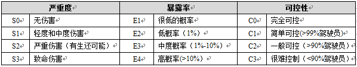

[toc]

# ISO 26262

## 相关术语

为了提高电子、电气、可编程逻辑控制器产品的安全性能，从1989年开始，世界范围内的业内专家，对产品安全性设计技术非常重视，并且计划将电子、电气及可编程电子安全控制系统相关的技术发展为一套成熟的安全设计技术标准。

针对道路车辆功能安全领域的专用标准即是ISO26262。通用电子电气标准IEC61508。

ISO26226标准的核心价值在于，它可以通过系统的功能安全研发管理流程，以及针对汽车电子控制系统硬件和软件的系统化验证和确认方法，保证电子系统的安全功能在面对各种严酷条件时不失效，从而保证驾乘人员以及路人的安全。

## ASIL等级确定与分解

### 引言

汽车上电子/电气系统（E/E）数量不断的增加，一些高端豪华轿车上有多达70多个ECU（Electronic Control Unit电子控制单元），其中安全气囊系统、制动系统、底盘控制系统、发动机控制系统以及线控系统等都是安全相关系统。当系统出现故障的时候，系统必须转入安全状态或者转换到降级模式，避免系统功能失效而导致人员伤亡。失效可能是由于规范错误(比如安全需求不完整)、人为原因的错误(比如：软件bug)、环境的影响( 比如：电磁干扰)等等原因引起的。为了实现汽车上电子/电气系统的功能安全设计，道路车辆功能安全标准 ISO 26262[1]于2011年正式发布，为开发汽车安全相关系统提供了指南，该标准的基础是适用于任何行业的电子/电气/可编程电子系统的功能安全标准IEC 61508[2]。

 ISO 26262标准中对系统做功能安全设计时，前期重要的一个步骤是对系统进行危害分析和风险评估，识别出系统的危害并且对危害的风险等级——ASIL等级（Automotive Safety Integration Level，汽车安全完整性等级）进行评估。ASIL有四个等级，分别为A，B，C，D，其中A是最低的等级，D是最高的等级。然后，针对每种危害确定至少一个安全目标，安全目标是系统的最高级别的安全需求，由安全目标导出系统级别的安全需求，再将安全需求分配到硬件和软件。ASIL等级决定了对系统安全性的要求，ASIL等级越高，对系统的安全性要求越高，为实现安全付出的代价越高，意味着硬件的诊断覆盖率越高，开发流程越严格，相应的开发成本增加、开发周期延长，技术要求严格。ISO 26262中提出了在满足安全目标的前提下降低ASIL等级的方法——ASIL分解，这样可以解决上述开发中的难点。

本文首先介绍了ISO 26262标准中的危害分析和风险评估阶段中的ASIL等级确定方法，然后介绍了ASIL分解的原则，并辅以实例进行说明。

### 危害分析和风险评估

依据ISO 26262标准进行功能安全设计时，首先识别系统的功能，并分析其所有可能的功能故障（Malfunction），可采用的分析方法有HAZOP，FMEA、头脑风暴等。如果在系统开发的各个阶段发现在本阶段没有识别出来的故障，都要回到这个阶段，进行更新。功能故障在特定的驾驶场景下，才会造成伤亡事件，比如近光灯系统，其中一个功能故障就是灯非预期熄灭，如果在漆黑的夜晚行驶在山路上，驾驶员看不清道路状况，可能会掉入悬崖，造成车毁人亡；如果此功能故障发生在白天就不会产生任何的影响。所以进行功能故障分析后，要进行情景分析，识别与此故障相关的驾驶情景，比如：高速公路超车、车库停车等。分析驾驶情景建议从公路类型：比如国道、城市道路、乡村道路等；路面情况：比如湿滑路面、冰雪路面、干燥路面；车辆状态：比如转向、 超车、制动、加速等；环境条件：比如：风雪交加、夜晚、隧道灯；交通状况：拥堵、顺畅、红绿灯等；人员情况：不如乘客、路人等几个方面去考虑。功能故障和驾驶场景的组合叫做危害事件（hazard event）， 危害事件确定后，根据三个因子——严重度（Severity）、暴露率（Exposure）和可控性（Controllability）评估危害事件的风险级别——ASIL等级。其中严重度是指对驾驶员、乘员、或者行人等涉险人员的伤害程度；暴露率是指人员暴露在系统的失效能够造成危害的场景中的概率；可控性是指驾驶员或其他涉险人员能够避免事故或伤害的可能性。这三个因子的分类在表1中给出。

ASIL等级的确定基于这三个影响因子，表2中给出了ASIL的确定方法，其中D代表最高等级， A代表最低等级，QM表示质量管理（Quality Management），表示按照质量管理体系开发系统或功能就足够了，不用考虑任何安全相关的设计。确定了危害的ASIL等级后，为每个危害确定至少一个安全目标，作为功能和技术安全需求的基础。

下面以EPB（Electrical Park Brake）系统为例介绍如何进行危害分析和风险评估。

EPB较传统的驻车制动器，除了驻车功能，还有动态起步辅助功能、紧急制动功能以及自动驻车功能等。这里我们以驻车功能为例，当驻车时，驾驶员通过按钮或其它方式发出制动请求，EPB系统在汽车的后轮上施加制动力，以防止车非预期滑行。该系统的危害有：非预期制动失效、非预期制动启动。相同的危害在不同的场景下的风险是不一样的，所以我们要对不同的驾驶场景进行分析。为了简化问题，这里我们仅对”非预期制动失效”这种功能故障进行风险评估。表3给出了EPB风险评估表，在该表中我们考虑的驾驶场景是车停在斜坡上，驾驶员不在车上。如果驾驶员在车上的话，驾驶员可通过踩刹车控制汽车滑行，可控性增加，那么所评估的ASIL等级会比表中的ASIL D低，但是对于同一个安全目标，如果评估的ASIL等级不同的话，要选择ASIL等级最高的那个。

通过以上分析，得出EPB系统的安全目标为：防止制动失效，ASIL等级为D。

### ASIL分解原则

通过上节介绍的危害分析和风险评估，我们得出系统的安全目标和相应的ASIL等级，从安全目标可以推导出开发阶段的安全需求，安全需求继承安全目标的ASIL等级。如果一个安全需求分解为两个冗余的安全需求，那么原来的安全需求的ASIL等级可以分解到两个冗余的安全需求上。因为只有当两个安全需求同时不满足时，才导致系统的失效，所以冗余安全需求的ASIL等级可以比原始的安全需求的ASIL等级低。ISO 26262标准的第9章给出了ASIL分解的原则，如图1所示。

分解后的ASIL等级后面括号里是指明原始需求的ASIL等级，比如ASIL D等级分解为ASIL C(D)和ASILA(D)等，因为集成和需求的验证仍然依据其原始的ASIL等级。ASIL 分解可以在安全生命周期的多个阶段进行，比如功能安全概念、系统设计、硬件设计、软件设计阶段。而且ASIL等级可以分多次进行，比如ASIL D等级分为ASIL C(D)和ASILA(D)，ASIL C(D)还可以继续分解为 ASIL B(D)和ASIL A(D )。

但是ASIL 分解的一个最重要的要求就是独立性，如果不能满足独立性要求的话，冗余单元要按照原来的ASIL等级开发。所谓的独立性就冗余单元之间不应发生从属失效（Dependent Failure），从属失效分为共因失效（Common Cause Failure）和级联失效(Cascading Failure) 两种。共因失效是指两个单元因为共同的原因失效，比如软件复制冗余，冗余单元会因为同一个软件bug导致两者都失效，为了避免该共因失效，我们采用多种软件设计方法。级联失效是指一个单元失效导致另一个单元的失效，比如一个软件组件的功能出现故障，写入另一个软件组件RAM中，导致另一个软件组件的功能失效，为了控制该级联失效，我们采用内存管理单元，可以探测到非法写入RAM的情况。

下面以一个例子介绍ASIL 分解的过程。

假设功能F，其输入信号为S1，S2，S3，这三个信号分别测量不同的物理量，是相互独立的，经过ECU内部的逻辑运算后，发送触发信息给执行器Actuator，功能F的架构示意图如图2所示。假设经过危害分析和风险评估后，功能F的ASIL等级为ASIL D，安全目标为避免非预期触发执行器。那么功能F的各个部分继承ASIL等级，即传感器、ECU、执行器都需要按照ASIL D 等级开发，如图3所示。

经过进一步的分析发现，当速度V>阈值时，非预期触发执行器，才能造成危险。那么我们在功能F的架构中，加入一个安全机制，安全机制的功能是当检测到速度V大于阈值时，不允许触发执行器。那么功能F的架构变为如图4所示。

功能F和安全机制是冗余安全需求，同时来满足安全目标，因此可以将功能F原来的ASIL等级在这两个需求上进行分解，分解为ASIL D(D)和QM(D)，分解后的ASIL等级如图5所示。

原来的传感器S1、S2、S3按照QM开发，速度传感器按照ASIL D开发，ECU里面的软件，原来的逻辑按QM开发，安全机制的逻辑按照ASIL D开发，不同ASIL等级的软件存在于一个ECU内，为了保证软件之间的独立性，保证两者之间不相互影响，需要考虑内存保护机制，合适的调度属性来保证存储空间和CPU时间的独立性，这样会增加软件开发的很多成本。那么我们进一步采取硬件上的分离来保证独立性，我们选择一个成本很低的简单的芯片（比如PGA, Programmable Gate Array）来运行安全机制中的软件（如图6所示）。需要注意的是PGA要使用独立的电源和时钟。

经过分解后，按照ASIL D开发的功能逻辑简单，使得开发变得简单，整体成本也得以降低。

### 结论

本文以EPB为例介绍了ISO 26262标准中安全目标及其ASIL等级确定的方法，安全目标的ASIL等级被开发阶段安全需求继承，如果安全需求的ASIL等级高，那么需要进行ASIL分解以降低ASIL等级，本文以实例介绍了ASIL分解的原则和步骤。ASIL分解并没有在ISO 26262中被强制要求执行，但是我们可以通过对系统进行分析、进而对系统架构进行调整，实现ASIL分解，可以解决因ASIL等级高而带来的开发成本、开发周期和技术要求等方面的问题。

## autosar 与 ISO26262 的关系

autosar是和功能安全相关的软件架构,AUTOSAR是天生符合ISO26262的软件架构(第6章)。